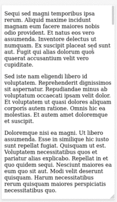

# Reading Progress

 

A reading progress bar using Javascript.

## Presentation

This script `reading-progress.js` allows you to print a progress bar in your website.

## Usage

To use it, it's as simple as:

1. Place the script in your HTML:

`<script src="reading-progress.js"></script>`

2. Create a new instance and specify the progress bar location:

```javascript
const myScrollBar = new readingProgress("article__content");
```

3. Add an event listener:

```javascript
document.addEventListener("scroll", () => {
  myScrollBar.init();
});
```

4. Use some CSS to customize your progress bar.

That's all.

Some precisions:

- `article__content` is the container ID where the progress bar will be added
- you can define some options in the `init` function.

## CSS

The script comes with a CSS file `reading-progress.css`. It contains the only rules needed to display the progress bar: backgrounds and a height.

```css
.reading-progress {
  background: transparent;
  height: 5px;
}

.reading-progress__bar {
  background: blue;
}
```

I did not add these rules inside the JS class so that you can customize more easily the progress bar appearance.

## Options

The `init` function accepts 4 options :

- `wrapperClasses`: one or more classes (an array) for the progress bar wrapper (`['wrapper-class, 'another-class']`)
- `barClasses`: one or more classes (an array) for the progress bar (`['progress-bar-class']`)
- `position`: a position relative to its container: `'top'` or `'bottom'`
- `recordFrom`: the element to use to calculate the scroll progression, either `'body'` for the whole page, `'container'` for its container or an ID (`'some-id'`).

By default, the reading progress bar:

- use `reading-progress__bar` and `reading-progress` classes for the progress bar and its wrapper,
- is displayed at the top of the container (defined when creating the instance),
- records the scroll progress of its container.

## Example

```javascript
const myScrollBar = new readingProgress("page-content");

document.addEventListener("scroll", () => {
  myScrollBar.init(["progress"], ["progress-bar"], "bottom", "body");
});
```

The progress bar will use the body instead of the container to record the scroll progression. So basically, it works like the scrollbar of your browser. It will be placed at the bottom of the container `page-content`.

## Demo



## Tips

**1.** By using an ID for `recordFrom`, you can place the progress bar inside a container (the header for example) and record the scroll progress of another element like the page content.

**2.** You can declare the event listener with a condition to display the progress bar only on your articles and not on the whole site.

## License

This project is open source and available under the [MIT License](https://github.com/ArmandPhilippot/minimalist-toc/blob/master/LICENSE).
